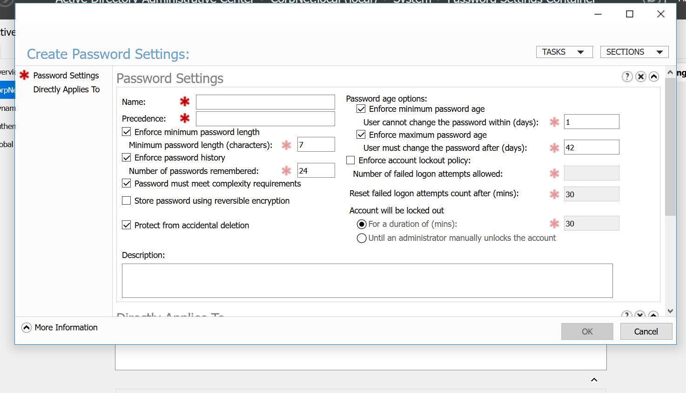
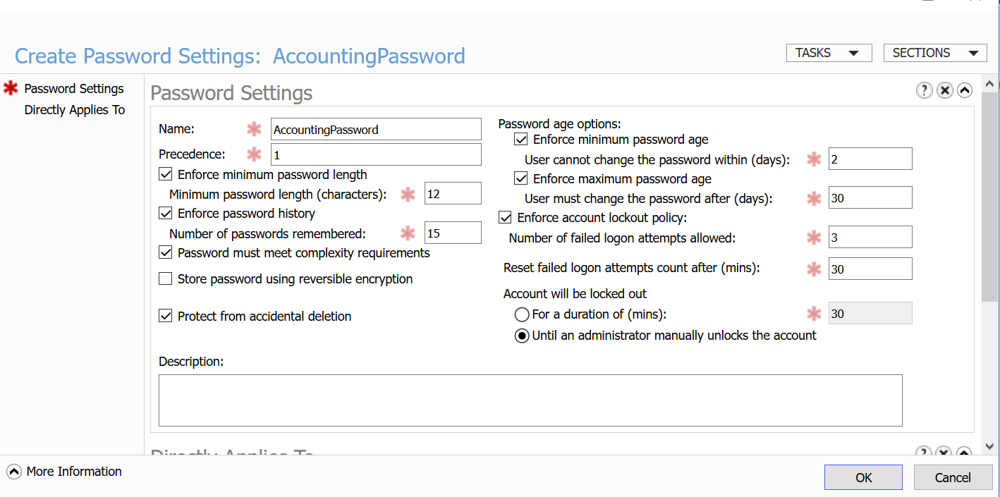
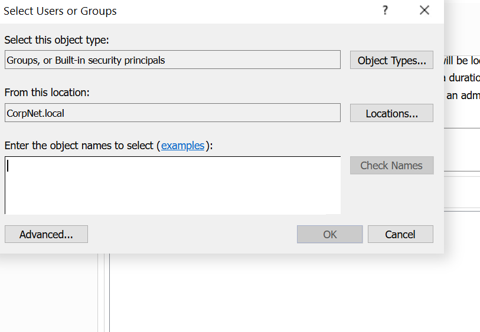
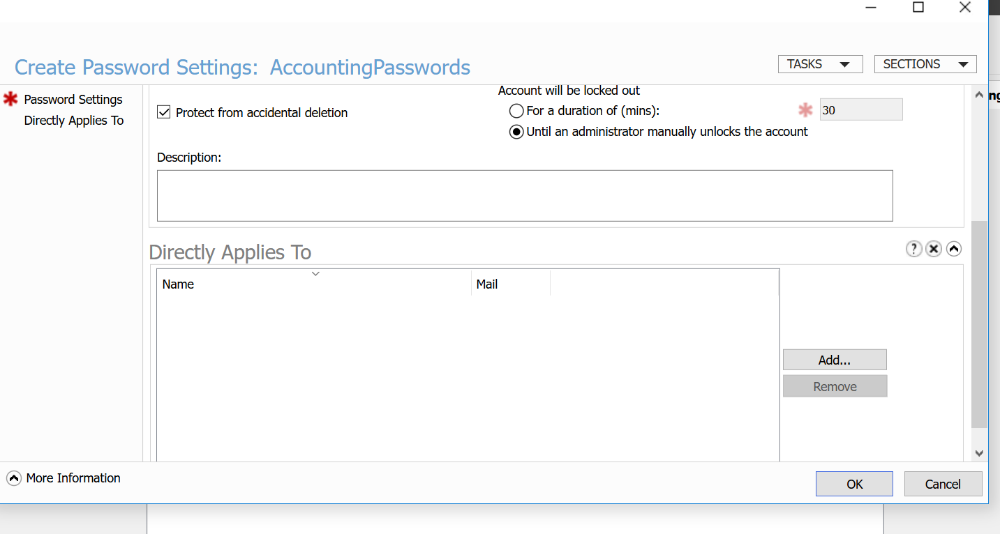
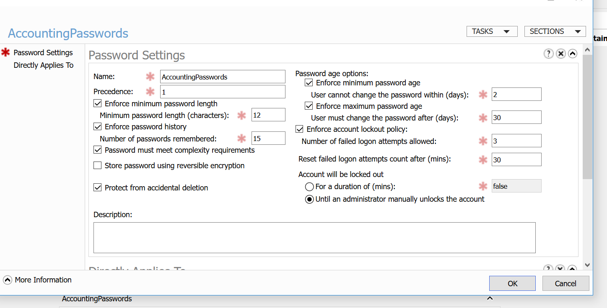
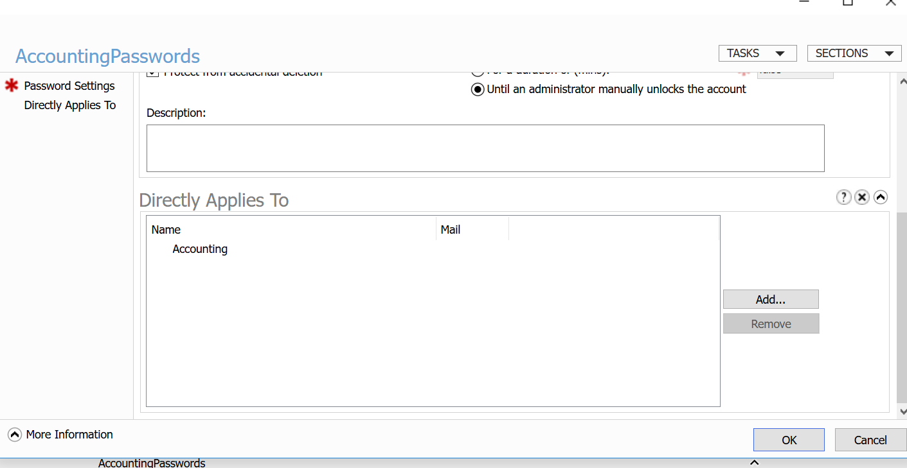
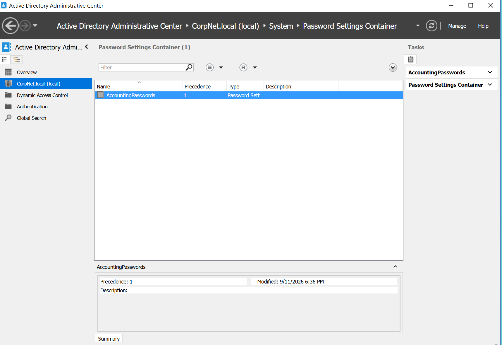
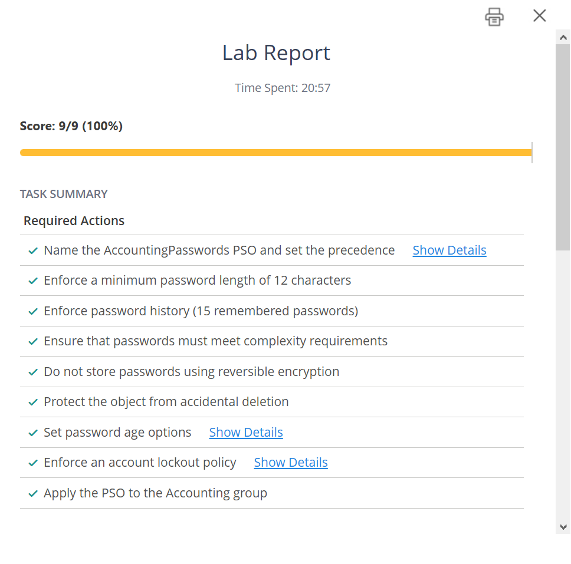

# Active Directory Fine-Grained Password Policy – Accounting Department


## Overview

This lab demonstrates the implementation of a Fine-Grained Password Policy (FGPP) in a Windows Server Active Directory environment.

A dedicated Password Settings Object (PSO) named `AccountingPasswords` was created and assigned to the `Accounting` security group to provide stricter password and account lockout controls for the Accounting department.

## Objectives

- Create a Fine-Grained Password Policy (PSO)
- Configure stronger password requirements
- Configure a restrictive account lockout policy
- Protect the PSO from accidental deletion
- Apply the PSO to the Accounting security group

## Lab Environment

| Component | Configuration |
|---|---|
| Domain | `CorpNet.local` |
| Management Tool | Active Directory Administrative Center |
| Policy Type | Fine-Grained Password Policy |
| PSO Name | `AccountingPasswords` |
| Target Group | `Accounting` |
| Lab Platform | TestOut |

## Password Policy Configuration

| Security Setting | Configuration |
|---|---:|
| PSO Name | `AccountingPasswords` |
| Precedence | `1` |
| Minimum Password Length | `12 characters` |
| Password History | `15 passwords` |
| Password Complexity | **Enabled** |
| Reversible Encryption | **Disabled** |
| Accidental Deletion Protection | **Enabled** |
| Minimum Password Age | `2 days` |
| Maximum Password Age | `30 days` |

## Account Lockout Configuration

| Lockout Setting | Configuration |
|---|---:|
| Failed Logon Attempts Allowed | `3` |
| Reset Failed Attempt Counter | `30 minutes` |
| Account Lockout | **Until manually unlocked by an administrator** |

## Policy Assignment

The `AccountingPasswords` PSO was assigned directly to the `Accounting` security group.

All users in the Accounting department are members of this security group.

```text
AccountingPasswords
        |
        └── Accounting Security Group
                └── Accounting Department Users
```

## Implementation

### 1. Access the Password Settings Container

The PSO was created in:

```text
CorpNet.local
└── System
    └── Password Settings Container
```

### 2. Create the Password Settings Object

The following identity settings were configured:

```text
Name: AccountingPasswords
Precedence: 1
```

### 3. Configure Password Requirements

```text
Minimum password length: 12
Password history: 15
Password complexity: Enabled
Reversible encryption: Disabled
Protect from accidental deletion: Enabled
```

### 4. Configure Password Age

```text
Minimum password age: 2 days
Maximum password age: 30 days
```

### 5. Configure Account Lockout

```text
Failed logon attempts allowed: 3
Reset failed attempt count after: 30 minutes
Account lockout: Until an administrator manually unlocks the account
```

### 6. Assign the PSO

The policy was assigned to:

```text
Accounting
```

This provides department-specific password security without changing the domain-wide password policy.

## Security Benefits

### Stronger Passwords
A minimum length of 12 characters increases resistance to password guessing.

### Password Reuse Prevention
Remembering the previous 15 passwords reduces password recycling.

### Password Complexity
Complexity requirements make predictable passwords harder to use.

### Brute-Force Protection
Locking an account after three failed attempts helps reduce repeated password-guessing attempts.

### Administrative Control
Accounts remain locked until an administrator manually unlocks them.

### Granular Security
FGPP allows stricter controls to be applied to a specific department or security group.

## Skills Demonstrated

- Active Directory
- Windows Server
- Identity and Access Management (IAM)
- Fine-Grained Password Policies (FGPP)
- Password Settings Objects (PSO)
- Active Directory Administrative Center
- Password Security
- Account Lockout Configuration
- Group-Based Security Policy Assignment
- Windows Server Security Hardening

## Lab Evidence

### Password Settings Object



### Accounting Password Policy Configuration



### Select Accounting Group



### Directly Applies To – Accounting



### Verify Password Settings



### Accounting Group Assignment



### PSO Created



### Lab Validation – 9/9 (100%)



## Validation

**Score: 9/9 (100%)**

All required configuration items were successfully implemented and validated.

- [x] Created `AccountingPasswords` PSO
- [x] Set precedence to `1`
- [x] Minimum password length set to `12`
- [x] Password history set to `15`
- [x] Password complexity enabled
- [x] Reversible encryption disabled
- [x] Accidental deletion protection enabled
- [x] Minimum password age set to `2 days`
- [x] Maximum password age set to `30 days`
- [x] Account lockout threshold set to `3`
- [x] Lockout counter reset after `30 minutes`
- [x] Manual administrator unlock enabled
- [x] PSO assigned to `Accounting`
- [x] Lab validated with `9/9 (100%)`

## Key Takeaway

Fine-Grained Password Policies provide granular control over authentication security in Active Directory.

In this lab, the Accounting department received stronger password and account lockout requirements through the `AccountingPasswords` PSO while the broader domain password policy remained unchanged.
